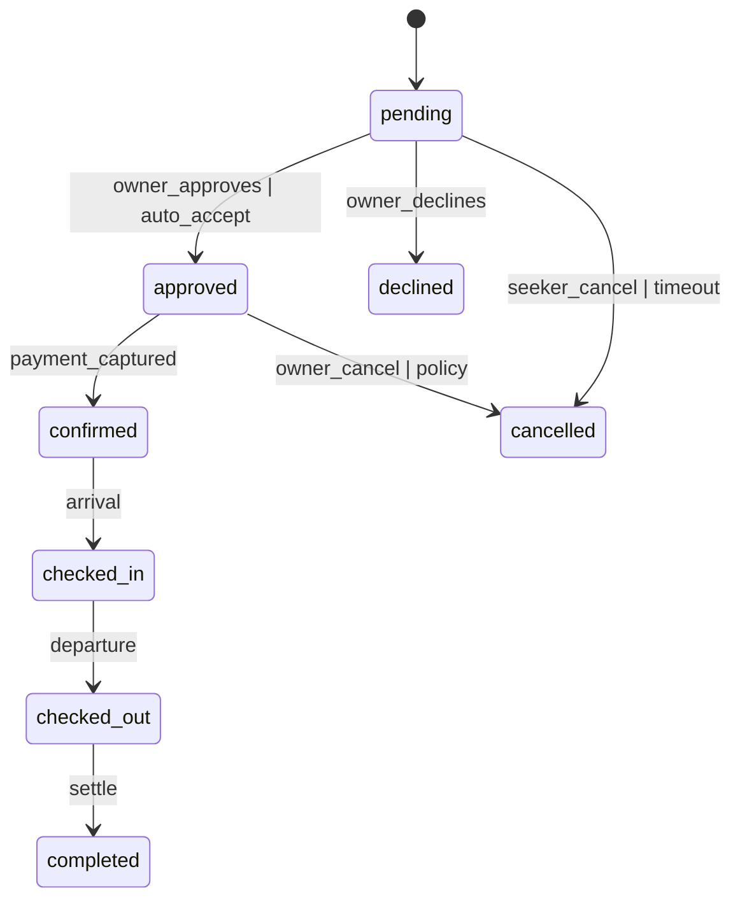
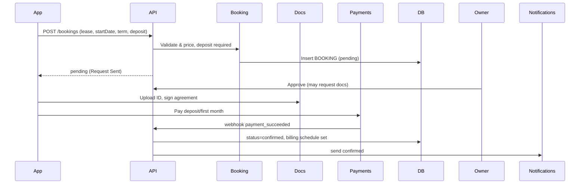

# Rentally Backend Architecture Guide

This document is a complete blueprint to implement the backend for the Rentally platform. It covers:
- Architecture and technology choices
- Domain modules and responsibilities
- Database design with ER diagrams and table specs
- End-to-end data flows, especially the Booking lifecycle (Daily/Monthly/Lease)
- Payments, escrow, wallet, payouts, and refunds
- Availability/locking, idempotency, notifications, and documents
- API design, security, observability, and CI/CD best practices

If you follow this guide, you can build a production-grade backend that cleanly supports all features exposed by the Flutter app.

---

## 1) Architecture Overview

- **Paradigm**: Start as a Modular Monolith with clean domain boundaries and an internal event bus. Split to microservices later as load increases.
- **Recommended Stack**:
  - Runtime: TypeScript + NestJS (Node.js)
  - Primary DB: MongoDB (NoSQL, ACID, advanced indexing)
  - Cache / Locks / Queues: Redis
  - Async/Event Bus: Kafka (or NATS for lightweight), fallback to Redis Streams in monolith
  - Search: OpenSearch/Elasticsearch (for geo, full-text)
  - Object Storage: AWS S3 (or MinIO)
  - File Scanning: ClamAV (malware scan for uploads)
  - Payments: Stripe or Razorpay + PayPal (regional)
  - Email/SMS/Push: SendGrid/Postmark, Twilio, FCM/APNS; WebPush where relevant
  - Docs & E-Sign: S3 + Sign providers (Dropbox Sign/Adobe Sign) or custom e-sign with PKI
  - Infra: Docker + Kubernetes (K8s) or ECS; IaC with Terraform
  - Observability: OpenTelemetry + Prometheus + Grafana; ELK/EFK for logs; Sentry for errors

- **Services (modules)** inside monolith (can later become microservices):
  - Identity & Auth (users/roles/KYC)
  - Listings (CRUD, availability, amenities, regions)
  - Booking (state machine, pricing, policies, availability locking)
  - Payments (escrow, refunds), Wallet & Payouts
  - Notifications (push/email/SMS, templates)
  - Documents (upload, verify, e-sign)
  - Search (index listings, geo queries)
  - Admin/Moderation (approvals, disputes)

- **Patterns**:
  - Hexagonal architecture (ports/adapters), CQRS per aggregate where useful
  - Domain Events + Outbox pattern for reliable event publishing from DB transactions
  - Idempotency keys for POSTs and payment webhooks
  - Config via environment + secrets manager (AWS Secrets Manager, Vault)

---

## 2) Data Model (ER Diagram)

```mermaid
erDiagram
  USER ||--o{ LISTING : owns
  USER ||--o{ BOOKING : makes
  USER ||--o{ WALLET : has
  LISTING ||--o{ LISTING_IMAGE : contains
  LISTING ||--o{ AVAILABILITY_SLOT : has
  LISTING ||--o{ LISTING_DOCUMENT : requires
  BOOKING ||--o{ BOOKING_PAYMENT : has
  BOOKING ||--o{ BOOKING_DOCUMENT : includes
  BOOKING ||--o{ BOOKING_EVENT : emits
  WALLET ||--o{ TRANSACTION : records
  BOOKING ||--o{ INVOICE : generates
  LISTING }o--|| CANCELLATION_POLICY : uses

  USER {
    uuid id PK
    text email UK
    text phone UK
    text password_hash
    text role  // seeker, owner, admin
    jsonb kyc  // status, data
    text country
    text currency
    timestamptz created_at
    timestamptz updated_at
  }

  LISTING {
    uuid id PK
    uuid owner_id FK
    text title
    text description
    text property_category // residential, commercial, plot
    text property_type     // apartment, office, plot, etc.
    jsonb rental_modes     // ["daily","monthly","lease"]
    numeric daily_price
    numeric monthly_price
    numeric lease_rate
    numeric security_deposit
    text furnishing        // unfurnished, semi, full
    boolean owner_verified
    jsonb amenities
    text country
    text city
    text state
    text zip
    point geo
    text currency
    int min_lease_months
    int max_lease_months
    int monthly_min_stay_months
    int monthly_notice_period_days
    uuid cancellation_policy_id FK
    boolean is_active
    timestamptz created_at
    timestamptz updated_at
  }

  LISTING_IMAGE {
    uuid id PK
    uuid listing_id FK
    text url
    int sort_order
  }

  LISTING_DOCUMENT {
    uuid id PK
    uuid listing_id FK
    text type // e.g., ownership_proof
    text url
    text status // pending, verified, rejected
  }

  AVAILABILITY_SLOT {
    uuid id PK
    uuid listing_id FK
    date day
    text status // available, held, booked, blocked
    timestamptz hold_expires_at
  }

  BOOKING {
    uuid id PK
    uuid listing_id FK
    uuid seeker_id FK
    uuid owner_id FK
    text rental_mode // daily, monthly, lease
    date check_in
    date check_out   // nullable for monthly/lease
    int monthly_duration_months
    int lease_term_months
    numeric total_price
    jsonb price_breakdown
    text status  // pending, approved, confirmed, checked_in, checked_out, completed, cancelled, declined
    text payment_status // none, hold, captured, refunded, partial_refund
    text escrow_status  // open, released, cancelled
    text documents_status // pending, submitted, verified, signed
    uuid cancellation_policy_id FK
    text currency
    timestamptz created_at
    timestamptz updated_at
  }

  BOOKING_PAYMENT {
    uuid id PK
    uuid booking_id FK
    text provider // stripe, razorpay, paypal
    text provider_payment_id
    text status // initiated, succeeded, failed, refunded
    numeric amount
    text currency
    jsonb metadata
    timestamptz created_at
  }

  BOOKING_DOCUMENT {
    uuid id PK
    uuid booking_id FK
    text type // id_proof, lease_agreement
    text url
    text status // pending, verified, rejected, signed
  }

  BOOKING_EVENT {
    uuid id PK
    uuid booking_id FK
    text type // created, approved, confirmed, cancelled, checked_in, checked_out, completed
    jsonb data
    timestamptz created_at
  }

  INVOICE {
    uuid id PK
    uuid booking_id FK
    text invoice_no
    jsonb line_items
    numeric total
    text currency
    text status // issued, void
    text url
    timestamptz created_at
  }

  CANCELLATION_POLICY {
    uuid id PK
    text name
    jsonb rules // per mode: windows, penalties
  }

  WALLET {
    uuid id PK
    uuid user_id FK
    numeric balance
    text currency
  }

  TRANSACTION {
    uuid id PK
    uuid wallet_id FK
    text type // booking_payment, payout, refund, commission
    numeric amount
    text currency
    text status // pending, completed, failed
    uuid booking_id FK
    jsonb metadata
    timestamptz created_at
  }
```

### Indexing Strategy
- `LISTING`: composite indexes on `(property_category, property_type)`, `(city, state, country)`, `geo` (PostGIS), `rental_modes` (GIN JSONB), `is_active`.
- `AVAILABILITY_SLOT`: `(listing_id, day)`, partial index for `status='available'`.
- `BOOKING`: `(listing_id, status)`, `(seeker_id, status)`, `(owner_id, status)`, `(created_at desc)`.
- `BOOKING_PAYMENT`: `(provider, provider_payment_id)`, `(booking_id)`.
- `WALLET`/`TRANSACTION`: `(user_id)`, `(wallet_id, created_at desc)`.

---

## 3) Booking State Machine and Flows

### States
- pending → approved → confirmed → checked_in → checked_out → completed
- pending → declined
- Any non-terminal → cancelled

### Transitions & Rules
- pending: created by seeker (daily with hold, monthly/lease request) or system from request
- approved: owner approves (manual) or auto-accept policy
- confirmed: payment captured and availability blocked; for request-based, occurs after approval + payment
- checked_in/checked_out: operational updates (time-bound)
- completed: after checkout/lease end & settlement
- cancelled/declined: policies enforce penalties & refunds



### Daily/Short-term Sequence
```mermaid
sequenceDiagram
  participant App
  participant API
  participant Booking
  participant Payments
  participant DB

  App->>API: POST /bookings (daily, checkIn, checkOut)
  API->>Booking: Validate & price; create pending + hold slots
  Booking->>DB: Insert BOOKING, hold AVAILABILITY_SLOT (TTL)
  API-->>App: pending + client_secret
  App->>Payments: Confirm payment
  Payments->>API: webhook payment_succeeded
  API->>DB: capture, finalize slots, status=confirmed
  API->>Notifications: send confirmed
```

### Monthly Sequence
```mermaid
sequenceDiagram
  participant App
  participant API
  participant Booking
  participant Payments
  participant DB

  App->>API: POST /bookings (monthly, startMonth, duration)
  API->>Booking: Validate & price; no checkOut initially
  Booking->>DB: Insert BOOKING (pending), initial invoice
  API-->>App: pending (Request Sent)
  Owner->>API: Approve
  App->>Payments: Pay first month (or mandate)
  Payments->>API: webhook payment_succeeded
  API->>DB: status=confirmed, schedule recurring invoices
  API->>Notifications: send confirmed
```

### Lease Sequence


### Availability & Locking
- Daily: write `AVAILABILITY_SLOT` rows per day; on pending create holds with TTL; confirm converts holds → booked.
- Monthly/Lease: manage month ranges at `BOOKING` with conflicts check; also optionally maintain range table for fast queries.
- Concurrency: Postgres row-level locks (`SELECT … FOR UPDATE`), Redis distributed locks for cross-process; retries with backoff.

### Idempotency
- All create/confirm endpoints accept `Idempotency-Key` header. Store keys in DB/Redis with response snapshot to safely retry on client/network errors.

---

## 4) API Design (REST-first)

- Versioning: prefix `/v1`
- Auth: OAuth 2.1 (PKCE) or JWT; session tokens with rotation; device tokens; RBAC roles (seeker/owner/admin)
- Pagination: `?page=…&pageSize=…` + `Link` headers
- Filtering & Sorting: allow query params; whitelists per resource
- Error Contracts: RFC 7807 (Problem Details JSON)
- Webhooks: secure via HMAC signature header; idempotency; replay protection

### Sample Endpoints
- Auth
  - POST `/v1/auth/register`, POST `/v1/auth/login`, POST `/v1/auth/refresh`
  - GET `/v1/users/me`
- Listings
  - GET `/v1/listings` (filters: category, modes, price range, city, text)
  - POST `/v1/listings` (owner)
  - GET `/v1/listings/:id`, PATCH `/v1/listings/:id`, DELETE `/v1/listings/:id`
  - GET `/v1/listings/:id/availability` (daily grid)
- Bookings
  - POST `/v1/bookings` (mode-aware payload)
  - GET `/v1/bookings?role=seeker|owner&status=…`
  - GET `/v1/bookings/:id`, POST `/v1/bookings/:id/cancel`
  - POST `/v1/bookings/:id/approve` (owner), POST `/v1/bookings/:id/decline`
  - POST `/v1/bookings/:id/check-in`, `/check-out`, `/complete`
- Payments
  - POST `/v1/payments/intent` (get client secret)
  - POST `/v1/webhooks/payments` (Stripe/Razorpay)
  - POST `/v1/payouts` (owner withdraw)
- Wallet
  - GET `/v1/wallet`, GET `/v1/transactions`
- Documents
  - POST `/v1/documents/upload`, POST `/v1/documents/sign`
- Notifications
  - POST `/v1/notifications/test`, GET `/v1/notifications`
- Admin
  - GET `/v1/admin/metrics`, `/v1/admin/listings/pending`, `/v1/admin/reviews`

---

## 5) Payments, Wallet, Payouts, Refunds

- Providers: Stripe (Cards, Apple/Google Pay), Razorpay (IN), PayPal (global), UPI (regional)
- Escrow model: capture funds to platform account → release to owner on check-in/after grace; hold/deposit for lease
- Refunds: partial and full per `CANCELLATION_POLICY` rules; create `TRANSACTION` rows for each mutation
- Recurring billing: monthly renewals via subscriptions/mandates (Stripe Billing, Razorpay Subscriptions)
- Multi-currency: store `currency` per booking; FX conversion via daily rates API; ledger in booking currency

---

## 6) Notifications & Channels

- Template engine with variables (Handlebars/MJML for email)
- Push (FCM/APNS), Email (SendGrid/Postmark), SMS (Twilio)
- Notification events: `booking_created`, `booking_approved`, `booking_confirmed`, `booking_cancelled`, `booking_completed`, `payment_failed`, `renewal_due`, `lease_extension`
- Deep-links (app routes):
  - pending → `/booking/requested/:id`
  - confirmed → `/booking-confirmation/:id`
  - others → `/booking-history/:id`

---

## 7) Documents & E-Sign

- Store raw files on S3; keep metadata in DB
- Virus scan on upload; image/pdf preview generation
- E-sign for lease agreements (Dropbox Sign/Adobe Sign APIs); store signed artifacts
- KYC verification service integration for high-value bookings

---

## 8) Search & Discovery

- OpenSearch index: denormalized listing docs with geo point, amenities, modes, price, rating
- Queries: full-text on title/description, geo-distance, filters on category/modes/price/furnishing/verified
- Sync: Debezium CDC or Outbox publisher to indexer worker

---

## 9) Security & Compliance

- Input validation, output encoding, strict content-type
- Rate limiting (token bucket) per IP/user/endpoint; WAF (Cloudflare/AWS WAF)
- Secrets in Secret Manager; TLS everywhere; PII encryption at rest (PGP/KMS)
- GDPR/CCPA: data retention, delete/export, consent logging
- Least privilege IAM; S3 signed URLs; link expiry
- Webhook signatures; replay protection via timestamps & nonce store

---

## 10) Observability & Reliability

- OpenTelemetry tracing across services; trace IDs propagated
- Metrics: request latency, error rates, booking funnel, payment success, payout delays
- Logs: structured JSON; correlation IDs; PII redaction
- Alerting: on-call rotations, SLOs (e.g., 99.9% API availability)
- DR: automated backups, PITR for Postgres; region failover plan

---

## 11) CI/CD & Environments

- Envs: dev/stage/prod with isolated resources
- CI: lint, type-check, unit tests, contract tests, migration dry-run
- CD: blue/green or canary; feature flags for gradual roll-outs
- DB migrations: Liquibase/Flyway/Prisma migration; zero-downtime compatible changes

---

## 12) Booking Domain Deep Dive

### Pricing
- Daily: base x nights + cleaning + service fee + taxes – discounts
- Monthly: monthly_price x months + deposit; proration rules for mid-month
- Lease: deposit + first month; schedule recurring invoices

### Policies & Refunds
- Use `CANCELLATION_POLICY.rules` JSON to compute penalty windows
- Auto-cancel pending holds after TTL; refund as per provider rules

### Availability
- Daily uses `AVAILABILITY_SLOT` with `hold_expires_at`; background job clears expired holds
- Monthly/Lease conflict detection based on month ranges (store canonical `start_month`, `end_month`)

### Idempotency
- Create Booking: idempotency key prevents duplicates on retry
- Payment webhooks: store `provider_payment_id` and finalization step is idempotent

---

## 13) Example Payloads

### Create Booking (Daily)
```json
{
  "listingId": "uuid",
  "rentalMode": "daily",
  "checkIn": "2026-07-01",
  "checkOut": "2026-07-05",
  "guests": 2,
  "idempotencyKey": "b02f..."
}
```

### Create Booking (Monthly)
```json
{
  "listingId": "uuid",
  "rentalMode": "monthly",
  "startMonth": "2026-07",
  "months": 3,
  "autoRenew": true,
  "idempotencyKey": "2e1c..."
}
```

### Approve Booking (Owner)
```json
{
  "note": "Looking forward to hosting you!"
}
```

### Payment Webhook (Stripe-like)
```json
{
  "type": "payment_intent.succeeded",
  "data": { "object": { "id": "pi_123", "amount": 45000, "currency": "usd" } },
  "created": 1730400000
}
```

---

## 14) Development Roadmap

1. Listings & Search
   - Extend listing schema with categories/modes/policies; admin approval flow
2. Booking (Daily)
   - Endpoints, availability grid, holds, payment capture, confirmation
3. Booking (Monthly/Lease)
   - Requests, approvals, documents, deposit, recurring billing
4. Wallet & Payouts
   - Owner ledger, withdrawals, commission, invoices
5. Notifications & Documents
   - Templates, channels, e-sign integration
6. Observability & Security
   - Tracing, metrics, logs; WAF, rate limiters, secrets
7. Admin & Analytics
   - Dashboards, moderation, BI exports

---

## 15) Technology Alternatives
- Python FastAPI + SQLAlchemy + Celery + Postgres + Redis + S3 + Kafka
- Go Fiber/Gin + GORM + Postgres + NATS + OpenTelemetry
- Java Spring Boot + JPA + Postgres + Kafka + Keycloak (Auth)

Choose what your team is strongest at; the domain, data model, and flows remain the same.

---

## 16) Mapping to Flutter App Routes
- Request Sent: `/booking/requested/:bookingId`
- Confirmation: `/booking-confirmation/:bookingId` and `/booking/confirmed/:bookingId`
- Booking detail: `/booking-history/:id`
- Monthly flow: `/monthly/start/:listingId`
- Lease chain: `/lease/contract-preview/:listingId` → `/lease/recurring-setup/:listingId` → `/documents/:listingId` → `/lease/billing/:leaseId` → `/lease/agreements`

Backend must return deep-link hints in notifications to open the correct route.

---

## 17) Best Practices Checklist
- Use Outbox pattern for reliable event delivery
- Every POST supports `Idempotency-Key`
- Strict validation & JSON schema contracts
- Comprehensive booking state machine with auditable `BOOKING_EVENT` stream
- Availability locking with TTL + cleanup jobs
- Separate read models for search (OpenSearch index)
- Encrypt PII and secrets; rotate keys
- Feature flags for risky releases; dark launch new flows
- Alert on error-rate spikes, payment failures, payout delays
- Keep “owner auto-accept” policy per mode configurable

---

This guide should give your backend team everything they need to implement the complete system with production-quality standards.
